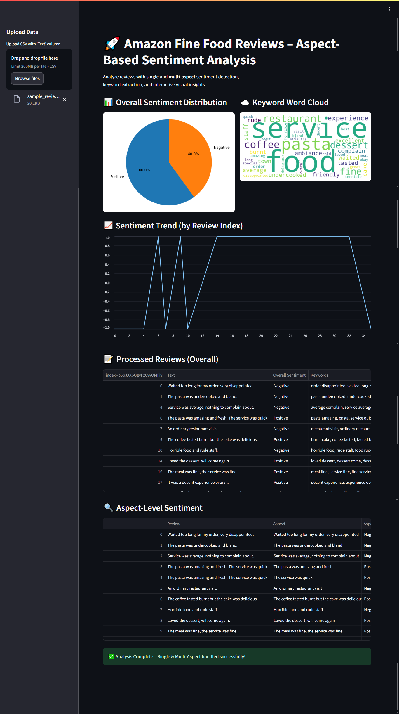

# 🍽️ Amazon Fine Food Reviews — Aspect-Based Sentiment Analysis (ABSA)

[](https://www.python.org/)
[](https://streamlit.io/)
[](LICENSE)

## 📌 Overview
This project performs **Aspect-Based Sentiment Analysis (ABSA)** on Amazon Fine Food Reviews.  
It extracts **aspects** (product features) from reviews and determines sentiment (**Positive**, **Negative**, **Neutral**) for each aspect.

---

## 📂 Folder Structure
project/
│
├── Amazon_Fine_Food_Analysis.ipynb # Main notebook (Phases 1–6)
├── app.py # Streamlit app for ABSA
├── requirements.txt # Dependencies
├── sample_reviews.csv # Demo dataset
│
├── screenshots/ # UI previews
│ └── demo_screenshot.png
│
└── README.md # Documentation


---

## 📸 Demo


---

## 🚀 How to Run

### **Option 1 — Run in Google Colab**
1. Upload the notebook to **Google Colab**.
2. Add your **NGROK** token to Colab Secrets (`NGROK_AUTH_TOKEN`).
3. Run all cells in order (Phases 1–6).
4. For the Streamlit app:
   - Run Phase 6 cells.
   - Click the generated ngrok link to open the app.

### **Option 2 — Run Locally**
```bash
# 1️⃣ Clone this repository
git clone https://github.com/MAhsaanUllah/Aspect-Based-Sentiment-Analysis-ABSA.git
cd Aspect-Based-Sentiment-Analysis-ABSA

# 2️⃣ Create virtual environment (optional but recommended)
python -m venv venv
source venv/bin/activate  # On Mac/Linux
venv\Scripts\activate     # On Windows

# 3️⃣ Install dependencies
pip install -r requirements.txt

# 4️⃣ Run the app
streamlit run app.py
📊 Features
✅ Text preprocessing (lowercasing, punctuation & stopword removal)
✅ Aspect extraction using spaCy + KeyBERT
✅ Aspect-level sentiment classification
✅ Visualization (bar charts, word clouds)
✅ Works with Google Colab + ngrok for public links

📈 Evaluation
Aspect Extraction: Precision / Recall / F1

Sentiment Classification: Accuracy, Macro F1, Confusion Matrix

Learning Curves: Detect overfitting/underfitting

🔮 Future Improvements
Multi-language support

Fine-tuned transformer models

Timeline-based sentiment trends

Permanent deployment (Streamlit Cloud, HuggingFace Spaces)

📜 License
This project is licensed under the MIT License.